# Full System ERD — Surgery Department

```mermaid
flowchart TD
    classDef entity fill:#e1f5fe,stroke:#01579b,stroke-width:2px,color:#000
    classDef attr fill:#fff9c4,stroke:#fbc02d,stroke-width:1px,color:#000
    classDef rel fill:#f3e5f5,stroke:#6a1b9a,stroke-width:2px,color:#000
    classDef note fill:#e8f5e9,stroke:#2e7d32,stroke-width:1px,stroke-dasharray: 5 5,color:#000

    %% ===== ENTITIES =====
    ePatient[PATIENT]:::entity
    eHospital[HOSPITAL]:::entity
    eDepartment[DEPARTMENT]:::entity
    eDeptLoc[DEPT_LOCATION]:::entity
    eDoctor[DOCTOR]:::entity
    eTreats[TREATS]:::entity
    ePrescription[PRESCRIPTION]:::entity
    eMedication[MEDICATION]:::entity
    ePresMed[PRESCRIPTION_MEDICATION]:::entity
    eRoom[ROOM]:::entity
    eAppointment[APPOINTMENT]:::entity
    ePayment[PAYMENT]:::entity
    eUser[USER]:::entity
    eContact[CONTACT_INQUIRY]:::entity
    eGeo[GEO_LOCATION]:::entity
    eScan[SCAN_DOCUMENT]:::entity

    %% ===== ATTRIBUTES =====
    %% Patient
    aPatPk([patient_number PK]):::attr
    aPatSsn([ssn UNIQUE]):::attr
    aPatName([name]):::attr
    aPatAddr([address]):::attr
    aPatPhone([phone]):::attr
    aPatBdate([birthdate]):::attr
    aPatSex([sex]):::attr
    aPatHist([medical_history]):::attr
    aPatBP([blood_pressure]):::attr
    aPatHR([heart_rate]):::attr
    aPatTemp([temperature]):::attr
    aPatAdmit([admission_date]):::attr

    %% Hospital
    aHospPk([hospital_id PK]):::attr
    aHospName([name]):::attr
    aHospAddr([address]):::attr

    %% Department
    aDeptPk([department_code PK]):::attr
    aDeptName([name UNIQUE]):::attr
    aDeptHospFk([hospital_id FK]):::attr
    aDeptChairFk([chairman_ssn FK]):::attr
    aDeptChairStart([chair_start_date]):::attr

    %% Department_Location
    aDLDeptFk([department_code FK]):::attr
    aDLLoc([location]):::attr

    %% Doctor
    aDocPk([ssn PK]):::attr
    aDocName([name]):::attr
    aDocSex([sex]):::attr
    aDocBdate([birth_date]):::attr
    aDocMajor([major_area]):::attr
    aDocDegree([degree]):::attr
    aDocDeptFk([department_code FK]):::attr
    aDocJoin([join_date]):::attr

    %% Treats
    aTrPatFk([patient_number FK]):::attr
    aTrDocFk([doctor_ssn FK]):::attr
    aTrHours([hours_per_week]):::attr

    %% Prescription
    aRxPk([prescription_id PK]):::attr
    aRxDocFk([doctor_ssn FK]):::attr
    aRxPatFk([patient_number FK]):::attr
    aRxDate([prescription_date]):::attr
    aRxStart([start_date]):::attr
    aRxEnd([end_date]):::attr

    %% Medication
    aMedPk([medication_id PK]):::attr
    aMedName([name UNIQUE]):::attr

    %% Prescription_Medication
    aPMRxFk([prescription_id FK]):::attr
    aPMMedFk([medication_id FK]):::attr
    aPMTimes([times_per_day]):::attr
    aPMDose([dose]):::attr

    %% Room
    aRoomPk([room_id PK]):::attr
    aRoomHospFk([hospital_id FK]):::attr
    aRoomNum([room_number]):::attr
    aRoomType([room_type]):::attr
    aRoomAvail([is_available]):::attr

    %% Appointment
    aAppPk([appointment_id PK]):::attr
    aAppPatFk([patient_number FK]):::attr
    aAppDocFk([doctor_ssn FK]):::attr
    aAppRoomFk([room_id FK]):::attr
    aAppDate([appointment_date]):::attr
    aAppStatus([status]):::attr

    %% Payment
    aPayPk([payment_id PK]):::attr
    aPayAppFk([appointment_id FK]):::attr
    aPayAmt([amount]):::attr
    aPayDate([payment_date]):::attr
    aPayMethod([payment_method]):::attr
    aPayStatus([status]):::attr

    %% User
    aUserPk([user_id PK]):::attr
    aUserUname([username UNIQUE]):::attr
    aUserPwd([password_hash]):::attr
    aUserRole([role]):::attr
    aUserType([person_type]):::attr
    aUserId([person_id]):::attr

    %% Contact_Inquiry
    aConPk([inquiry_id PK]):::attr
    aConName([name]):::attr
    aConEmail([email]):::attr
    aConSubj([subject]):::attr
    aConMsg([message]):::attr
    aConTime([submitted_at]):::attr
    aConRes([is_resolved]):::attr

    %% Geo_Location
    aGeoPk([location_id PK]):::attr
    aGeoLat([latitude]):::attr
    aGeoLon([longitude]):::attr
    aGeoAddr([address]):::attr
    aGeoType([entity_type]):::attr
    aGeoId([entity_id]):::attr

    %% Scan_Document
    aScanPk([scan_id PK]):::attr
    aScanPatFk([patient_number FK]):::attr
    aScanDocFk([doctor_ssn FK]):::attr
    aScanFile([file_path]):::attr
    aScanTime([upload_date]):::attr
    aScanDesc([description]):::attr

    %% ===== RELATIONSHIPS (Diamonds) =====
    rContains{contains}:::rel
    rHasLoc{has locations}:::rel
    rChaired{chaired by}:::rel
    rEmploys{employs}:::rel
    rTreatsRel{treats}:::rel
    rWrites{writes}:::rel
    rReceives{receives}:::rel
    rIncludes{includes}:::rel
    rContainsRoom{contains}:::rel
    rAssigned{assigned to}:::rel
    rBooks{books}:::rel
    rSched{scheduled with}:::rel
    rHasPay{has payment}:::rel
    rHasScan{has scans}:::rel
    rUploads{uploads}:::rel

    %% ===== ENTITY → ATTRIBUTES =====
    ePatient --- aPatPk & aPatSsn & aPatName & aPatAddr & aPatPhone & aPatBdate & aPatSex & aPatHist & aPatBP & aPatHR & aPatTemp & aPatAdmit
    eHospital --- aHospPk & aHospName & aHospAddr
    eDepartment --- aDeptPk & aDeptName & aDeptHospFk & aDeptChairFk & aDeptChairStart
    eDeptLoc --- aDLDeptFk & aDLLoc
    eDoctor --- aDocPk & aDocName & aDocSex & aDocBdate & aDocMajor & aDocDegree & aDocDeptFk & aDocJoin
    eTreats --- aTrPatFk & aTrDocFk & aTrHours
    ePrescription --- aRxPk & aRxDocFk & aRxPatFk & aRxDate & aRxStart & aRxEnd
    eMedication --- aMedPk & aMedName
    ePresMed --- aPMRxFk & aPMMedFk & aPMTimes & aPMDose
    eRoom --- aRoomPk & aRoomHospFk & aRoomNum & aRoomType & aRoomAvail
    eAppointment --- aAppPk & aAppPatFk & aAppDocFk & aAppRoomFk & aAppDate & aAppStatus
    ePayment --- aPayPk & aPayAppFk & aPayAmt & aPayDate & aPayMethod & aPayStatus
    eUser --- aUserPk & aUserUname & aUserPwd & aUserRole & aUserType & aUserId
    eContact --- aConPk & aConName & aConEmail & aConSubj & aConMsg & aConTime & aConRes
    eGeo --- aGeoPk & aGeoLat & aGeoLon & aGeoAddr & aGeoType & aGeoId
    eScan --- aScanPk & aScanPatFk & aScanDocFk & aScanFile & aScanTime & aScanDesc

    %% ===== RELATIONSHIP CONNECTIONS =====
    eHospital -->|1| rContains
    rContains -->|N| eDepartment

    eDepartment -->|1| rHasLoc
    rHasLoc -->|N| eDeptLoc

    eDoctor -->|0..1| rChaired
    rChaired -->|1| eDepartment

    eDepartment -->|1| rEmploys
    rEmploys -->|N| eDoctor

    eDoctor -->|M| rTreatsRel
    rTreatsRel -->|N| ePatient

    eDoctor -->|1| rWrites
    rWrites -->|N| ePrescription

    ePatient -->|1| rReceives
    rReceives -->|N| ePrescription

    ePrescription -->|M| rIncludes
    rIncludes -->|N| eMedication

    eHospital -->|1| rContainsRoom
    rContainsRoom -->|N| eRoom

    eRoom -->|1| rAssigned
    rAssigned -->|N| eAppointment

    ePatient -->|1| rBooks
    rBooks -->|N| eAppointment

    eDoctor -->|1| rSched
    rSched -->|N| eAppointment

    eAppointment -->|1| rHasPay
    rHasPay -->|1| ePayment

    ePatient -->|1| rHasScan
    rHasScan -->|N| eScan

    eDoctor -->|1| rUploads
    rUploads -->|N| eScan

    %% ===== CONSTRAINTS NOTE =====
    noteConstraints["COMPLETENESS & DISJOINTNESS CONSTRAINTS<br/>─────────────────────────────<br/>User generalization (Person):<br/>• Completeness: PARTIAL — not all Users<br/>  link to a Person (admin/nurse roles<br/>  have no person_id)<br/>• Disjointness: DISJOINT — a User can<br/>  be EITHER Patient OR Doctor, not both"]:::note
```

## Completeness & Disjointness Constraints

| Constraint | Type | Description |
|------------|------|-------------|
| **User → Person** (partial) | **Completeness** | Not every User must be linked to a person record. Admin and nurse roles have `person_type` and `person_id` as NULL. |
| **User → Person** (disjoint) | **Disjointness** | A User can be associated with **either** a Patient **or** a Doctor, never both. Enforced by `person_type` CHECK constraint. |
| **Doctor ↔ Department** (total) | **Completeness** | Every Doctor must belong to exactly one Department (`department_code NOT NULL`). |
| **Department → Chairman** (partial) | **Completeness** | Not every Department must have a chairman; `chairman_ssn` is nullable. |
| **Department → Hospital** (total) | **Completeness** | Every Department must belong to a Hospital (`hospital_id NOT NULL`). |
| **Room → Hospital** (total) | **Completeness** | Every Room must belong to a Hospital (`hospital_id NOT NULL`). |
| **Appointment → Payment** (partial) | **Completeness** | Not every Appointment has a Payment yet (payment can be created later). |
