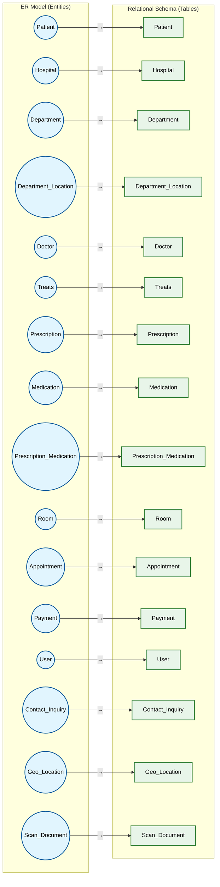

# Relational Mapping — ER to Schema

## Mapping Rules Applied

| ER Construct | Mapping Rule | Resulting Table(s) |
|---|---|---|
| **Strong Entity** (Patient, Hospital, Doctor, etc.) | Direct mapping: each attribute → column, PK → PK | 1 table per entity |
| **Weak Entity** (Department_Location) | Include owner's PK as FK; composite PK = owner PK + partial key | 1 table |
| **M:N Relationship** (Treats, Prescription_Medication) | New table with both entity PKs as composite PK + FK | 1 junction table |
| **1:N Relationship** (Hospital → Dept, Dept → Doctor) | FK on N-side referencing PK of 1-side | FK column added to N-side table |
| **1:1 Relationship** (Appointment → Payment) | FK on either side with UNIQUE constraint | FK + UNIQUE on one table |
| **Self-referencing / Recursive** (Dept chairman → Doctor) | FK column referencing same table's PK | FK added to Department (chairman_ssn → Doctor.ssn) |

## Normalization

All tables are in **3NF**:

- **1NF**: Atomic columns, no repeating groups
- **2NF**: No partial dependencies — composite PKs are minimal and all non-key attributes depend on the full PK
- **3NF**: No transitive dependencies — all non-key attributes depend solely on the PK
